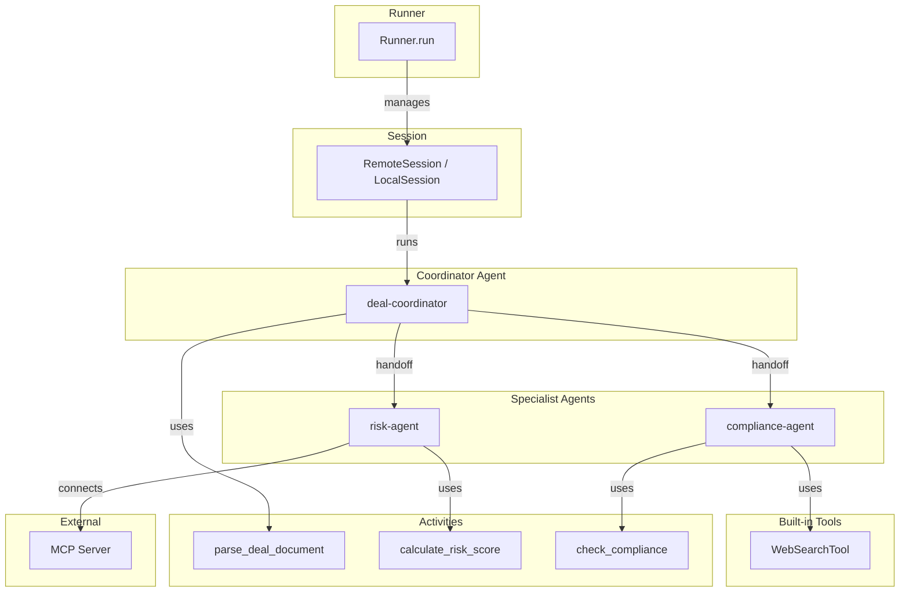

# Durable Agents: LLM Agents on Mistral Workflows

Durable Agents allow you to run LLM agents within your Mistral workflows.

## Installation

To use Durable Agents, install the Mistral plugin:

```bash
uv add 'mistralai-workflows[mistralai]'
```

## What is a Durable Agent?

A Durable Agent is an LLM agent that executes within a workflow, benefiting from:

- **Durability**: Agent state is preserved across failures and restarts
- **Tool Integration**: Use activities as agent tools
- **Multi-Agent Handoffs**: Agents can delegate tasks to specialized agents
- **MCP Support**: Connect to external tools via Model Context Protocol (stdio / SSE)

## Architecture Overview



The Runner orchestrates agent execution through a Session. Agents can hand off tasks to specialized agents and each agent can use activities, built-in Mistral tools or MCP servers as tools.

## Core Components

### Agent

The `Agent` class defines an LLM agent with its model, instructions, tools and handoffs:

```python
import mistralai.workflows as workflows
import mistralai.workflows.plugins.mistralai as workflows_mistralai

agent = workflows_mistralai.Agent(
    model="mistral-medium-latest",
    name="my-agent",
    description="Agent that performs specific tasks",
    instructions="Use tools to complete the user's request.",
    tools=[my_activity],  # Workflows activities as tools
    handoffs=[other_agent],  # Agents to delegate to
)
```

### Runner

The `Runner` executes an agent with user inputs and manages the conversation loop:

```python
import mistralai.workflows as workflows
import mistralai.workflows.plugins.mistralai as workflows_mistralai

outputs = await workflows_mistralai.Runner.run(
    agent=agent,
    inputs="What is the interest rate for 2024?",
    session=session,
    max_turns=10,
)
```

### Sessions

Sessions manage agent state and API communication. Two session types are available:

| Session         | Use Case                   | Backend               |
| --------------- | -------------------------- | --------------------- |
| `RemoteSession` | Production (recommended)   | Mistral Agents SDK    |
| `LocalSession`  | Experimental / On-premises | Direct completion API |

## Basic Example

Here's a simple agent workflow that uses an activity as a tool:

```python
import mistralai
import mistralai.workflows as workflows
import mistralai.workflows.plugins.mistralai as workflows_mistralai

@workflows.activity()
async def get_interest_rate(year: int) -> dict:
    """Get the interest rate for a given year.

    Args:
        year: The year to get the interest rate for
    """
    # Your implementation here
    return {"interest_rate": 1.62}

@workflows.workflow.define(name="finance_agent_workflow")
class FinanceAgentWorkflow:
    @workflows.workflow.entrypoint
    async def entrypoint(self, question: str) -> dict:
        session = workflows_mistralai.RemoteSession()

        agent = workflows_mistralai.Agent(
            model="mistral-medium-latest",
            name="finance-agent",
            description="Agent for financial queries",
            instructions="Use tools to answer financial questions.",
            tools=[get_interest_rate],
        )

        outputs = await workflows_mistralai.Runner.run(
            agent=agent,
            inputs=question,
            session=session,
        )

        answer = "\n".join([
            output.text for output in outputs
            if isinstance(output, mistralai.TextChunk)
        ])

        return {"answer": answer}
```

## Multi-Agent Handoffs

Agents can delegate tasks to specialized agents using handoffs. The system automatically manages the handoff conversation:

```python
import mistralai.workflows as workflows
import mistralai.workflows.plugins.mistralai as workflows_mistralai

## Create a specialized agent for interest rate queries
interest_rate_agent = workflows_mistralai.Agent(
    model="mistral-medium-latest",
    name="ecb-interest-rate-agent",
    description="Agent for European Central Bank interest rate research",
    instructions="Use tools to get the interest rate for a given year.",
    tools=[get_interest_rate],
)

## Main agent that can hand off to the specialist
finance_agent = workflows_mistralai.Agent(
    model="mistral-medium-latest",
    name="finance-agent",
    description="Agent for financial queries",
    handoffs=[interest_rate_agent],  # Can delegate to interest_rate_agent
)

outputs = await workflows_mistralai.Runner.run(
    agent=finance_agent,
    inputs="What was the ECB interest rate in 2023?",
    session=workflows_mistralai.RemoteSession(),
)
```

When the finance agent receives a query about ECB interest rates, it can automatically hand off to the specialized `interest_rate_agent`.

## MCP Integration

Connect to external tool servers using the Model Context Protocol. Two transport types are supported:

### Stdio MCP Server

For local command-line MCP servers:

```python
from mistralai.workflows.plugins.mistralai import MCPStdioConfig

mcp_config = MCPStdioConfig(
    command="npx",
    args=["-y", "@modelcontextprotocol/server-everything"],
    name="server-everything",
)

agent = Agent(
    model="mistral-medium-latest",
    name="mcp-agent",
    description="Agent with access to MCP tools",
    mcp_clients=[mcp_config],
)
```

### SSE MCP Server

For remote MCP servers over Server-Sent Events:

```python
from mistralai.workflows.plugins.mistralai import MCPSSEConfig

mcp_config = MCPSSEConfig(
    url="https://your-mcp-server.com/sse",
    timeout=60,
    name="remote-tools",
    headers={"Authorization": "Bearer your-token"},  # Optional
)

agent = workflows_mistralai.Agent(
    model="mistral-medium-latest",
    name="sse-mcp-agent",
    description="Agent with access to remote MCP tools",
    mcp_clients=[mcp_config],
)
```

## Built-in Tools

Use Mistral's built-in tools alongside activities:

```python
import mistralai
import mistralai.workflows as workflows
import mistralai.workflows.plugins.mistralai as workflows_mistralai

agent = workflows_mistralai.Agent(
    model="mistral-medium-latest",
    name="web-search-agent",
    description="Agent with web search capability",
    instructions="Use web search to answer user questions",
    tools=[mistralai.WebSearchTool()],
)
```

Available built-in tools:

- `mistralai.WebSearchTool()` - Web search capability
- `mistralai.CodeInterpreterTool()` - Code execution
- `mistralai.ImageGenerationTool()` - Image generation
- `mistralai.DocumentLibraryTool()` - Document analysis

## Session Types

### RemoteSession (Recommended)

Uses the Mistral Agents SDK for production workloads:

```python
import mistralai.workflows as workflows
import mistralai.workflows.plugins.mistralai as workflows_mistralai

session = workflows_mistralai.RemoteSession()

outputs = await workflows_mistralai.Runner.run(
    agent=agent,
    inputs="Your question here",
    session=session,
)
```

Features:

- Full Agents SDK integration
- Automatic agent creation and updates
- Managed conversation state
- Production-ready

### LocalSession (Experimental)

Runs agents locally using the completion endpoint:

```python
import mistralai.workflows as workflows
import mistralai.workflows.plugins.mistralai as workflows_mistralai

session = workflows_mistralai.LocalSession()

outputs = await workflows_mistralai.Runner.run(
    agent=agent,
    inputs="Your question here",
    session=session,
)
```

Use cases:

- On-premises deployments that does not have access to Agents (Bora)
- Development and testing
- Full context control

:::warning
`LocalSession` is experimental and may be removed in future versions. Use `RemoteSession` for production workloads.
:::

## Complete Workflow Example

A full example combining activities, handoffs and workflow orchestration:

```python
import asyncio
import mistralai
import mistralai.workflows as workflows

@workflows.activity()
async def calculate_risk_score(deal_type: str, amount: float) -> dict:
    """Calculate financial risk score for a deal.

    Args:
        deal_type: The type of deal being analyzed
        amount: The monetary amount of the deal
    """
    risk_score = min(100.0, amount / 10000.0)
    risk_factors = []
    if amount > 100000:
        risk_factors.append("High value transaction")
    return {"risk_score": risk_score, "risk_factors": risk_factors}

@workflows.workflow.define(name="deal_analysis_workflow")
class DealAnalysisWorkflow:
    @workflows.workflow.entrypoint
    async def entrypoint(self, deal_request: str) -> dict:
        """Analyze a deal request.

        Args:
            deal_request: The deal request to analyze
        """
        session = workflows_mistralai.RemoteSession()

        # Risk assessment agent
        risk_agent = workflows_mistralai.Agent(
            model="mistral-medium-latest",
            name="risk-agent",
            description="Analyzes financial risk of deals",
            instructions="Use the risk calculation tool to assess deal risk.",
            tools=[calculate_risk_score],
        )

        # Main coordinator agent
        coordinator = workflows_mistralai.Agent(
            model="mistral-medium-latest",
            name="deal-coordinator",
            description="Coordinates deal analysis",
            instructions="Analyze the deal request and hand off to specialists.",
            handoffs=[risk_agent],
        )

        outputs = await workflows_mistralai.Runner.run(
            agent=coordinator,
            inputs=deal_request,
            session=session,
        )

        analysis = "\n".join([
            output.text for output in outputs
            if isinstance(output, mistralai.TextChunk)
        ])

        return {"analysis": analysis}

if __name__ == "__main__":
    asyncio.run(workflows.run_worker([DealAnalysisWorkflow]))
```

## Best Practices

1. **Use RemoteSession for production** - It provides better reliability and Agents SDK integration
2. **Keep activities granular** - Small, focused activities work better as agent tools
3. **Provide clear instructions** - Agent performance depends on clear instructions
4. **Use handoffs for specialization** - Create specialized agents for specific domains and improve context management by delegating tasks
5. **Handle tool errors gracefully** - Activities used as tools should return meaningful error messages
